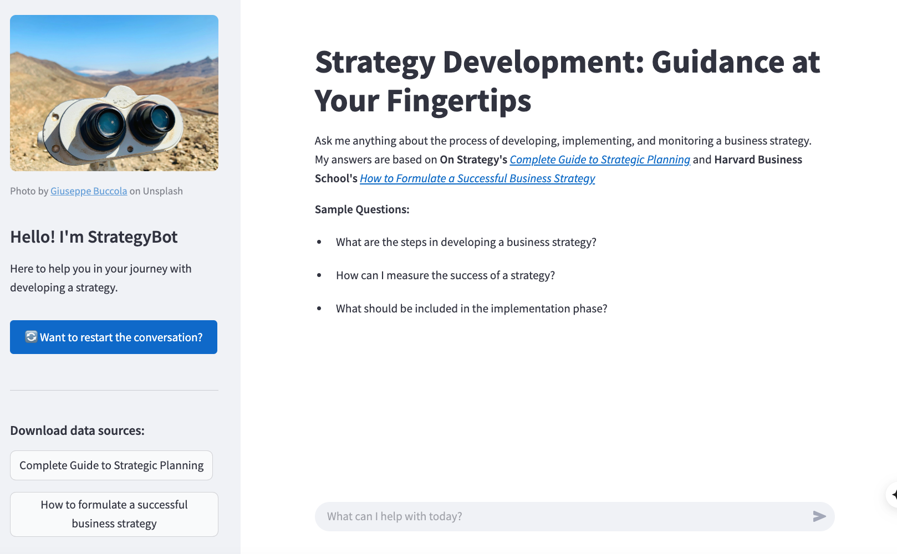

# StrategyBot: Strategy Guidance Chatbot in Streamlit

This repository contains **StrategyBot**, a chatbot built with Python and Streamlit to support users in navigating strategy-related questions. The chatbot draws from two publicly available strategy documents in PDF format and provides guidance based on their content.

## Approach

To build the chatbot, I used two strategy documents as the knowledge base and parsed them using `SimpleDirectoryReader` from **LlamaIndex**. The app allows users to interact with the documents through a chat interface, ask follow-up questions, and receive context-aware answers grounded in the content of the PDFs.

Additional features include:
- **Feedback collection**: Users can rate answers with a thumbs up/down.
- **Conversation logging**: Questions, answers, timestamps, and feedback are recorded and appended to a `.csv` file.
- **Data export**: The collected interaction data can be used for analysis and future improvements.
- **Session control**: Users can refresh the chat at any time to start a new session.

## Preview

Here’s a screenshot of the deployed Streamlit app showing the user interface:



## Files

### Data
- `Complete-Guide-to-Strategic-Planning.pdf`: Strategy resource file from [*On Strategy*](https://onstrategyhq.com/complete-strategy-guide/) 
- `how-to-formulate-successful-business-strategy.pdf`: Strategy resource file from [*Harvard Business School*](https://info.email.online.hbs.edu/strategy-formulation-ebook)

### Scripts
- `StrategyBot_ChatBot.py`: Main Python script to run the Streamlit app

### Images
- `bot.png`: Avatar image for the chatbot assistant  
- `magnifying-glass.png`: Avatar image for the user  
- `giuseppe-buccola-zcKLLpMAbXU-unsplash.jpg`: Header image used as a banner in the app  
- `StrategyBot_preview.png`: Screenshot of the deployed chatbot interface  

## Requirements
To run this app, you'll need a **Hugging Face account** and an **API token**. You can create one at [huggingface.co](https://huggingface.co) and generate a token.

## Using the Files
1. Clone or download this repository.
2. In `StrategyBot_ChatBot.py`, update the file paths and insert your Hugging Face API token.
3. From your terminal, run the Streamlit app with:
   ```bash
   streamlit run [your_file_path]/StrategyBot_ChatBot.py
   ```

## Languages and Libraries
- Python 3.10.12  
- pandas 2.2.2  
- llama-index 0.12.31  

## Tools
- Streamlit  
- Hugging Face (for LLM inference)
